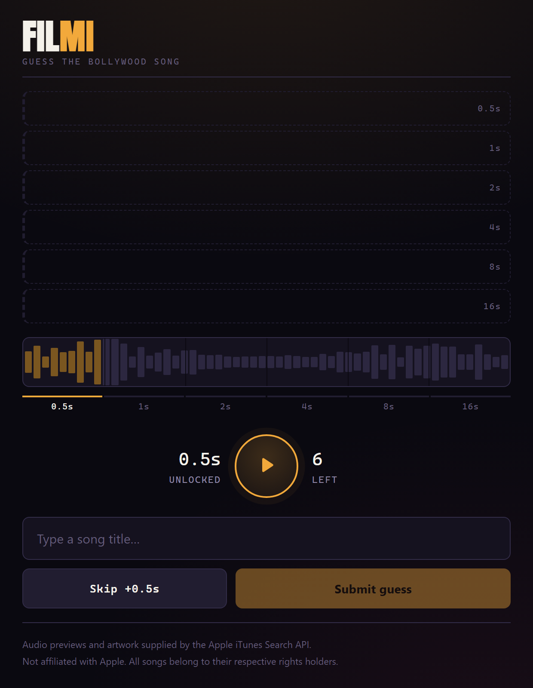

# Filmi — guess the Bollywood song

A Heardle/Songless-style guessing game for Hindi film music. You hear half a
second of a song and name it; every wrong guess or skip unlocks more audio
(0.5s → 1s → 2s → 4s → 8s → 16s), six attempts total.

Audio comes from the free **iTunes Search API** — no key, no auth, no backend.



## Play it

Open `index.html` in any browser. That's the whole install — one self-contained
file, no build step, no server.

It needs an internet connection to reach Apple for previews. With no network it
falls back to synthesised stand-in audio so the interface is still explorable,
and says so plainly on every screen.

### On a phone

There is nothing to install, but the file has to be reachable *as a URL* — iOS
sandboxes local HTML, so mailing yourself the file does not work. Either serve
the folder over the local network (`npx serve .`, then browse to the machine's
LAN address) or put it on any static host.

The build names its output `index.html` precisely so that a static host serves
the game at the bare URL with no configuration. On GitHub Pages, pointing at the
repository root is the entire setup and a push is a deploy. Added to the iOS
home screen it runs chromeless, like an app.

## Why one file with everything inlined

The game is also published as a claude.ai Artifact, which runs under a CSP that
blocks requests to **every** external host. A CDN `<script>` for React or a
linked Google Font would silently fail there. So React and the display face
(Anton) are inlined at build time, and the page makes zero subresource requests.
`build.ps1` fails the build if that ever stops being true.

The same CSP blocks Apple, which is why the hosted Artifact has no real songs —
that limitation is the sandbox, not the code. Run the local file for real audio.

## Adding songs

The catalog is a plain array at the very top of `src/template.html` (character
offset ~1700, deliberately above the vendor blobs so it stays easy to find):

```js
{ title: "Kesariya", artist: "Arijit Singh", movie: "Brahmastra", trackId: 1648663570 },
```

Order matters only in that a song's position is its `uid` for the session;
appending is always safe. `trackId` is optional but strongly recommended. **Filmi search is dirty** and a
plain term search regularly returns the wrong recording:

- *Tum Hi Ho* has a **remix** ranked directly behind the original.
- *Senorita* is spelled **Señorita** on Apple Music, so an ASCII search returns
  a completely different song (*Ik Junoon (Paint It Red)*).
- Soundtracks are full of `(Encore)`, `(Reprise)`, Bhojpuri versions and mashups.

The 18 seed songs were resolved and verified by hand. Songs added without a
`trackId` fall back to a scored search that penalises remix/unplugged/cover/
karaoke and rewards `Original Motion Picture Soundtrack` — usually right, not
guaranteed. Find an id with:

```
https://itunes.apple.com/search?term=YOUR+SONG&entity=song&country=IN
```

For adding songs by the hundred rather than one at a time, see below.

## Harvesting the catalog

`build/harvest.js` rewrites the catalog array from the iTunes API. It is run by
hand, never as part of a build — a cold run takes about an hour and hits Apple
roughly 1,300 times. Every response is cached under `build/.harvest-cache`
(gitignored), so a re-run to change only the selection rules costs nothing and
an interrupted crawl resumes where it stopped.

```
node build/harvest.js               harvest, then rewrite the catalog
node build/harvest.js --dry         harvest and report, write nothing
node build/harvest.js --composers 4 stop after N composers (a smoke run)
```

Bollywood ships in soundtrack albums, so the catalog scales by harvesting
**films, not songs**. Seeded with 28 music directors spanning the 1940s to now:
composer → `artistId` → up to 60 albums → expand each. Roughly one request per
film, ~8–10 songs per film, which yields about 7,600 candidates.

That album ceiling is a relevance cutoff, not just a budget, and it was set too
low at first. Apple orders a composer's albums big-film-first, but for the
prolific moderns the 2020s sit further down than that suggests: Pritam's
*Brahmastra* is his album #25, *Animal* #28, *Bhool Bhulaiyaa 2* #29, *Dunki*
#36. A cutoff of 20 stopped the catalog dead at 2019 — and no amount of
rescoring could have recovered those films, because they were never fetched.

**An album's own tracks say what kind of album it is.** A compilation labels
every track with where it came from — `Tere Bina (From "Guru")` — and a
soundtrack has no need to. So albums are classified after expansion rather than
by name, and a compilation's songs become popularity *signal* instead of
catalog candidates.

Popularity matters because the harvest finds ~7,600 songs and the game ships
~1,200, so *something* has to choose — and a catalog of uniformly obscure songs
is a vocabulary test, not a game. What ranks them is **position**: where a song
sits on its soundtrack, and where that soundtrack sits in Apple's ordering of
the composer's albums. A soundtrack opens with the song the film is selling, and
Apple lists a composer's big films first. An appearance on the composer's own
best-of is a smaller bonus on top.

Album position is scored as a **percentile of the composer's catalog**, not an
absolute index. An absolute one has a cliff at the album ceiling, so everything
past it scores identically — which meant widening the crawl to reach
*Brahmastra* fetched it and then ranked it last. As a percentile, Pritam's 25th
album of 77 reads as top-third while Ismail Darbar's 12th of 13 correctly reads
as the bottom.

### Filling the catalog era by era

The catalog is filled **per era against a quota**, not as one global ranking,
because a global one is always won by whichever era has the most releases on
Apple. Ranked globally the 2010s took 160 of 300 slots and the 2020s got 10.
Position ranks songs honestly *within* an era; it says nothing about how many
slots an era deserves, so the quotas are set explicitly:

```
2020s      293 / 300      2000s      300 / 300
2010s      300 / 300      pre-2000   264 / 300
```

The spans are deliberately unequal and it shows. `pre-2000` skims the best of
six decades, while the 2020s quota is drawn from about six years and so reaches
much further down its own ranking — the recent bucket is the obscure one. Both
short-falls are the pool running out, not a cap biting.

Alongside the quotas: 3 songs per film globally, and 20 per composer *per era*,
so a prolific composer can appear across all four without owning any one.

Era needs a year, and Apple's per-track date is the date of **that pressing** —
a 1975 song on a 2015 reissue reads as 2015. Across a whole crawl the same film
usually appears in several pressings, so the earliest one seen is used as the
film's year. That is still only a floor, and a film whose every pressing is a
reissue stays late; it is what stops reissued classics from being counted as new
releases.

### What didn't work

Two better-sounding theories were measured here and both lost.

**Counting *Various Artists* "Bollywood Hits" compilation appearances**, on the
theory that hits get repackaged endlessly and deep cuts never do. What Apple's
India store returns for those searches is party/workout sets and small-label
re-recordings (`Bollywood Hits (Versi Melayu)`, `Best Of Bollywood LO-FI`, and
one jazz album). Of 310 harvested candidates, exactly **3** matched — none of
them *Tum Hi Ho*, *Kabira* or *Channa Mereya*.

**Ranking by a dedicated single release** (`Kesariya (From "Brahmastra") -
Single`), on the theory that labels only cut singles for songs they are pushing.
This was the heaviest term in the score until it was measured against a canon
list, and it is not merely weak — it is *anti-correlated*. Only 124 of 2,703
candidates carry a single, and they are the modern promotional drip where a
label cuts one per track: 31% of Sachin-Jigar's songs and 14% of Tanishk
Bagchi's, against 0% for Jatin-Lalit, Laxmikant-Pyarelal and Shankar Jaikishan.
Not one of *Tum Hi Ho*, *Kabira*, *Channa Mereya*, *Gerua*, *Badtameez Dil* or
*Deewani Mastani* has one. It was measuring release era, not fame, which is
fatal for a catalog spanning the 1950s to now — weighting it heaviest bought
*Chingam Chabake* and *Illegal Weapon 2.0* at the cost of the canon (27% recall
against 44% for position). The signal is still harvested, because the album list
names singles for free, but it no longer scores.

The pattern in both: a signal has to be comparable *across* composers and eras
to order a catalog that spans them. Position is; release packaging isn't.

## Build and test

```powershell
pwsh build/build.ps1           # src/template.html -> index.html
pwsh build/build.ps1 -Verify   # build, then run both suites
```

```
test/test.js           55 checks — rules, normalisation, song identity, variant
                       scoring, simulated games, and LIVE iTunes resolution over
                       JSONP: the whole catalog batched (1,164 ids in 6 requests)
                       and single songs by the runtime path
test/test-offline.js   12 checks — simulates a CSP refusal; asserts both
                       resolution paths degrade in under 2s instead of hanging
test/test-ui.js        47 checks — drives the real App component through whole
                       rounds against a hand-rolled React. Blocked scenario: a
                       fixture catalog with a deliberate title collision.
                       Online scenario: lookups answer for real and one song is
                       deliberately preview-less, covering lazy resolution,
                       prefetch, and the dud-song reroll
```

`test.js` hits the real API, so it needs a network connection and will fail if
Apple is unreachable. Both suites run the actual shipped source: they extract the
app IIFE straight out of `src/template.html` and execute it against stubbed
DOM/React globals, so they cannot drift from what ships.

## How the audio works

`fetch()` to `itunes.apple.com` is blocked by CORS — Apple sends no
`Access-Control-Allow-Origin`. The API does support **JSONP**, so the app appends
`&callback=fn` and injects a `<script>`. Script tags aren't subject to the
same-origin policy, so this works from `file://` and from any host. Verified:
both `/search` and `/lookup` return `text/javascript` with the callback wrapper.

Previews resolve **one song at a time**, as rounds need them — a round needs one
`previewUrl`, so resolving the catalog to play a single song is work that scales
with the catalog for no gain. The page makes exactly one request on its own: a
prefetch of one song at load, which makes the first round instant and settles
whether we are in demo mode in time for the badge to be on the start screen.
After that each round resolves the *next* song in the background while you
guess, so the lookup is already done by the time you click "Next song".

Cost is flat: **one small request per round**, no matter how big the catalog
gets. A song that resolves but has no preview is marked dead and re-dealt; a
request that *fails* is a different thing entirely and puts the session into
demo mode.

Snippet length is enforced by driving `currentTime` against a
`requestAnimationFrame` loop and pausing at the limit.

Apple's terms require the track link wherever their previews are used, so
`trackViewUrl` is rendered as "Listen on Apple Music" on every reveal,
win or lose.

## Song identity

Nothing keys off a title. `buildCatalog()` stamps every entry with a `uid` (its
catalog index) and precomputed `nTitle` / `nMovie`, and the preview cache, the
played-set, the waveform seed and the win check all use `uid`.

This matters because Hindi titles collide across films — *Tere Bina*, *Zaalima*,
*Bekhayali* each exist in more than one. Keying by title would both collide in
the preview cache and mark you correct for naming a **different film's song of
the same name**. When a title is ambiguous the typeahead refuses a hand-typed
answer and makes you pick a row (every row shows its film), and the guess row
then reads `Tere Bina · Bombay` so a wrong answer cannot be mistaken for a win.

## Scaling notes

Measured limits, for anyone pushing this further:

- `lookup?id=<collectionId>&entity=song` returns a complete OST in **one**
  request (9 tracks for *Yeh Jawaani Hai Deewani*).
- `lookup?id=<artistId>&entity=album` returns up to **200** albums in one.
- `/lookup` accepts **200 ids per batch** — so verifying a 300-song catalog
  against the live API costs two requests, which is why `test.js` can afford to
  do it on every run.
- Apple's soft rate limit is ~20 requests/minute; past it you get a `403` and
  the harvester backs off for a minute.

Beyond a few thousand songs the remaining lever is difficulty: the popularity
score the harvester already computes is the natural dial for tiers, eras, or
music-director filters.

## Layout

```
index.html               built, playable — this is the deliverable
src/template.html        source; song catalog at the top, app JS at the bottom
vendor/                  React 18.3.1 UMD + Anton woff2 (base64), inlined at build
build/build.ps1          assembly + self-containment checks
build/harvest.js         rebuilds the song catalog from the iTunes API
test/                    node test suites
```

## Attribution

Previews and artwork come from the Apple iTunes Search API. Not affiliated with
Apple. All songs belong to their respective rights holders.
